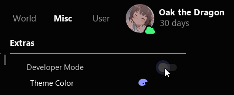
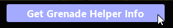
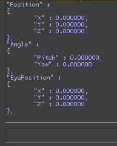

## [Back to main page](/README.md)
---
<a name="-1"></a>

### [Developer Mode](#14)

|Parameters|
|--------|
|[Map](#0)|
|[Name](#1)|
|[Type](#2)|
|[Position](#3)|
|[Angle](#4)|
|[EyePosition](#5)|
|[ForceAccuracy](#6)|
|[QuickStop](#7)|
|[Jump](#8)|
|[Crouch](#9)|
|[Slowwalk](#10)|
|[Forward](#11)|
|[Backward](#12)|
|[Throw](#13)|


---
## <a name="0"></a>Map

---

### Information:

| Name | Type | Description |
| :--- | :--- | :--- |
| Map | string | Map Name |

```json
"Map" : "de_mirage"
```

[return to parameters](#-1)

---
## <a name="1"></a>Name

---

### Information:

| Name | Type | Description |
| :--- | :--- | :--- |
| Name | string | Location name |

```json
"Name" : "CT Spawn"
```

[return to parameters](#-1)

---
## <a name="2"></a>Type

---

### Information:

| Name | Type | Description |
| :--- | :--- | :--- |
| Type | int | GrenadeType |

### Translation

| value | translation |
| :--- | :--- |
| 0 | none |
| 1 | molotov |
| 2 | he grenade |
| 3 | smoke |
| 4 | flashbang |

```json
"Type" : 1
```

[return to parameters](#-1)

---
## <a name="3"></a>Position

---

### Information:

| Name | Type | Description |
| :--- | :--- | :--- |
| Position | Vector3D | Start Location |

### Typename Vector3D

| Name | Type |
| :--- | :--- |
| X | int |
| Y | int |
| Z | int |

```
"X" : 0.0,
"Y" : 0.0,
"Z" : 0.0
```

```json
"Position" :
{
  "X" : 0.0,
  "Y" : 0.0,
  "Z" : 0.0
}
```

[return to parameters](#-1)

---
## <a name="4"></a>Angle

---

### Information:

| Name | Type | Description |
| :--- | :--- | :--- |
| Angle | QAngle | Throw Angle |

### Typename QAngle

| Name | Type |
| :--- | :--- |
| Pitch | int |
| Yaw | int |

```
"Pitch" : 0.0,
"Yaw" : 0.0
```

```json
"Angle" :
{
  "Pitch" : 0.0,
  "Yaw" : 0.0
},
```

[return to parameters](#-1)

---
## <a name="5"></a>EyePosition

---

### Information:

| Name | Type | Description |
| :--- | :--- | :--- |
| EyePosition | Vector3D | Start Eye position |

### Typename Vector3D

| Name | Type |
| :--- | :--- |
| X | int |
| Y | int |
| Z | int |

```
"X" : 0.0,
"Y" : 0.0,
"Z" : 0.0
```

```json
"EyePosition" :
{
  "X" : 0.0,
  "Y" : 0.0,
  "Z" : 0.0
}
```

[return to parameters](#-1)

---
## <a name="6"></a>ForceAccuracy

---

### Information:

| Name | Type | Description |
| :--- | :--- | :--- |
| ForceAccuracy | bool | Must be 1:1 on the Throw Position |


```json
"ForceAccuracy" : false
```

[return to parameters](#-1)

--- 
## <a name="7"></a>QuickStop

---

### Information:

| Name | Type | Description |
| :--- | :--- | :--- |
| QuickStop | bool | Enable Quickstop after Throw |


```json
"QuickStop" : false
```

[return to parameters](#-1)

--- 
## <a name="8"></a>Jump

---

### Information:

| Name | Type | Description |
| :--- | :--- | :--- |
| Jump | int | Jump Tick |

### Translation

| value | translation |
| :--- | :--- |
| -1 | disabled |

```json
"Jump" : -1
```

[return to parameters](#-1)

--- 
## <a name="9"></a>Crouch

---

### Information:

| Name | Type | Description |
| :--- | :--- | :--- |
| Crouch | int | Crouch Tick |

### Translation

| value | translation |
| :--- | :--- |
| -1 | disabled |

```json
"Crouch" : -1
```

[return to parameters](#-1)

--- 
## <a name="10"></a>Slowwalk

---

### Information:

| Name | Type | Description |
| :--- | :--- | :--- |
| Slowwalk | int | Start Slowwalk Tick |

### Translation

| value | translation |
| :--- | :--- |
| -1 | disabled |

```json
"Slowwalk" : -1
```

[return to parameters](#-1)

--- 
## <a name="11"></a>Forward

---

### Information:

| Name | Type | Description |
| :--- | :--- | :--- |
| Forward | int | Start Forward Tick |

### Translation

| value | translation |
| :--- | :--- |
| -1 | disabled |

```json
"Forward" : -1
```

[return to parameters](#-1)

--- 
## <a name="12"></a>Backward

---

### Information:

| Name | Type | Description |
| :--- | :--- | :--- |
| Backward | int | Start Backward Tick |

### Translation

| value | translation |
| :--- | :--- |
| -1 | disabled |

```json
"Backward" : -1
```

[return to parameters](#-1)

--- 
## <a name="13"></a>Throw

---

### Information:

| Name | Type | Description |
| :--- | :--- | :--- |
| Throw | int | Throw Backward Tick |

### Translation

| value | translation |
| :--- | :--- |
| -1 | disabled |

```json
"Throw" : 2
```

[return to parameters](#-1)

--- 
## <a name="14"></a>Developer Mode


**Enable Developer Mode**




**Prints Grenade Position into Console**






[return to top](#-1)

---
